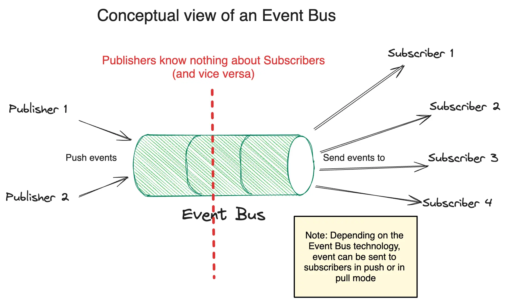

# When and how to use an "eventbus" inside a Golang application?

{align=right}

## Eventbus?

An **event bus** is a software architecture pattern that facilitates communication between components without requiring the components to explicitly be aware of each other.
It works by receiving events from producer components and dispatching these events to consumer components that have expressed an interest in those types of events.

It's widely used in distributed microservices contexts with technologies such as RabbitMQ, Redis, Kafka or other cloud providers' proprietary implementations.

But it can also make sense in a monolithic application, and that's what I'm going to talk about here.

<!-- more -->



## In a Golang application?

Let's say you have a big monolith application in Golang, with a lot of clearly separated packages:

- `conf`
- `cache`
- `datastore`
- `metrics`
- `profiler`
- ...

You add a few callbacks between these packages (for example, when `datastore` is updated, a part of the `cache` is flushed) but it remains manageable.

But, when you have implemented the "configuration hot reload" feature, you introduced a kind of "callbacks hell" as nearly all your packages may change their behavior when the configuration is updated.

As your `conf` package only provides a single hook to be called when the configuration is updated and to avoid circular dependencies, you probably fight a lot to keep your code clean and maintainable.

IMHO, a clean solution for this is to use an event bus **inside** your application. So it's clearly a **code pattern** and not an architecture pattern here.

## How to implement it?

You will find plenty of implementations on the web. But my requirements were:

- [KISS](https://en.wikipedia.org/wiki/KISS_principle) (not because of [NIH syndrome](https://en.wikipedia.org/wiki/Not_invented_here) but because the goal was to keep the code clean and simple)
- Typed events (no `interface{}` type else it will be a nightmare when you change the event structure) thanks to [Go Generics](https://go.dev/doc/tutorial/generics).

I ended up with a very basic implementation (a little bit simplified here for the sake of clarity):

```go
// SubscriberName is the name for a specific subscriber. Useful only for unsubscribing.
type SubscriberName string

// eventBus represents a generic event bus.
// A subscriber (identified by its name) is a simple function which
// takes exactly one argument of the parametrized type.
type eventBus[T any] struct {
	subscribers map[SubscriberName]func(event T)
	mutex       sync.Mutex
}

// New creates a new event bus.
func New[T any]() *eventBus[T] {
	return &eventBus[T]{
		subscribers: make(map[SubscriberName]func(event T)),
	}
}

// Subscribe adds a subscriber to the event bus.
func (eb *eventBus[T]) Subscribe(subscriberName SubscriberName, callback func(event T)) {
	eb.mutex.Lock()
	defer eb.mutex.Unlock()
	eb.subscribers[subscriberName] = callback
}

// Unsubscribe removes a subscriber from the event bus.
func (eb *eventBus[T]) Unsubscribe(subscriberName SubscriberName) {
	eb.mutex.Lock()
	defer eb.mutex.Unlock()
	delete(eb.subscribers, subscriberName)
}

// Publish sends an event to all subscribers of the event bus.
func (eb *eventBus[T]) Publish(event T) {
	var res int
	eb.mutex.Lock()
	defer eb.mutex.Unlock()
	for _, callback := range eb.subscribers {
		callback(event)
	}
}
```

### Where to create the event bus?

To use it, You can create a dedicated new package with a single instance of the event bus (for this `ConfEvent` event type):

```go
type ConfEvent struct {
    // ...
}

var ConfEventBus = eventbus.New[ConfEvent]()
```

Note: you can also add this to your `conf` package depending on your context.

### On the consumer side

Then, at the consumer side (`cache` for instance):

```go
func (cache *Cache) SubscribeToConfEventBus() {
    bus.ConfEventBus.Subscribe("cache", func(event bus.ConfEvent) {
        // conf changed => flush all cache
        cache.Flush()
    })
}
```

### On the producer side

On the producer side:

```go
// conf changed => let's publish an event
bus.ConfEventBus.Publish(ConfEvent{...})
```

## Conclusion

By introducing a new (but very small) "code middleware", we cleaned the dependency graph and probably lowered the cognitive complexity of our code.

No magic at all here. We could have done the same with a smart use of interfaces and callbacks.

But, IMHO, it's cleaner and easier to understand with this event bus pattern. And it's also easier to maintain and extend.

!!! warning "Be careful!"

	If you used this pattern in a distributed context, you probably used it
	in a "fire and forget" way (especially with long-running tasks triggered by
	some events).
	
	But with this basic implementation on a monolith, you have to keep in mind
	that subscribers' callbacks are executed synchronously with the `Publish()` call.