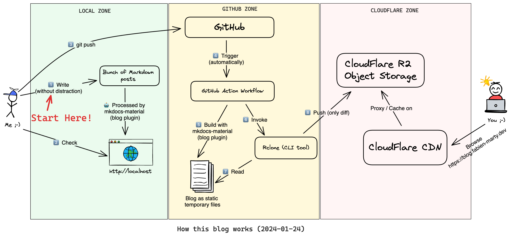

# How is this blog operated? And how is it securely hosted for free at Cloudflare?

{align=right : style="width:300px"}

## My requirements for a personal blog

### Markdown

For ages, I've been a big fan of Markdown[^1], like I was a big fan of [LaTeX](https://www.latex-project.org/) before.

When I write a document, I want to focus on the content and not on the formatting. I don't want to be disturbed by
the glitches of a WYSIWYG editor and I want to use my favorite tools and not a dedicated UI.

Maybe, it's a kind of personal obsession 😅 But as it's a personal blog...

<!-- more -->

### Git!

As Markdown is a text file format, it is "Version Control Friendly".

Here again, what better tool than `Git` to manage versions, backups, synchronize a local draft state
with one published on a remote server!

Since my blog is public (by construction), I can also use a public GitHub repository
to host it for free, with all the advantages that this can bring[^2].

### Automation!

I'm a big fan of automation in general and of CI/CD in particular. I like my work to end with a git push[^3].
Beyond that, I'd rather spend my energy automating things than spending it on repetitive manual tasks.

Not always a time-saver in the short term, but then again, this is a personal blog, so you have to enjoy yourself too!

### Free but solid and fast hosting!

In my professional life, I've worked a lot with web servers and high-traffic hosting. I'm well aware
that this is a difficult art, and that it can be costly in terms of time and money.

What's more, as I now work for a company that specializes in technical SEO, I also know how important delivery performance is.

Finally, this is a personal project, I can't count on a team to update a server or relaunch a service on the weekend or during my vacations, so let's delegate this part to a quality third-party service!

## Overall architecture

I think that the previous diagram is self-explanatory:

- I mainly use: [`mkdocs-material`](https://squidfunk.github.io/mkdocs-material/) and a few [`mkdocs`](https://www.mkdocs.org/) plugins to generate the static website. So I can preview the result locally and push markdown file changes to GitHub when it's ready.
- After that, everything is automated by GitHub Actions:
  - the website is built and deployed by [`Rclone` diff tool](https://rclone.org/) to [Cloudflare R2](https://www.cloudflare.com/en-gb/developer-platform/r2/) which has a pretty generous free tier.
  -the website is exposed to the world by Cloudflare CDN directly from the R2 bucket.
 
!!! info

    To directly expose a static website hosted in a Cloudflare R2 bucket with Cloudflare CDN you have to add a "transform rule" to deal with `index.html` pages:

    - (incoming request) custom filter expression:
    `ends_with(http.request.uri.path, "/") and (http.host eq "blog.fabien-marty.dev")`
    - (rewrite parameters) dynamic rewrite to:
    `concat(http.request.uri.path, "index.html")`

## Conclusion

I'm pretty happy with these technical choices and this architecture. The workflow is simple and efficient, the website is fast and secure, and the hosting is completely free.

If you want more details, feel free to have a look at [the public repository of this blog](https://github.com/fabien-marty/blog).

[^1]:
    - Very simple and easy to learn
    - Portable and readable everywhere (without preprocessing)
    - Focus on content
    - Version Control Friendly
    - Widely adopted
    - ...

[^2]:
  - Free GitHub Actions
  - External PR to fix typos and other little mistakes (let's dream! 🌈)
  - [Comments system](https://giscus.app/) based on GitHub Discussions (no backend)
  - ...

[^3]: or by a PR merge